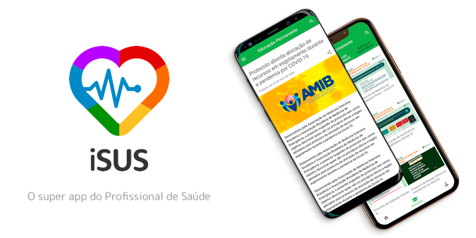

# App iSUS

Esse é o repositório do aplicativo **iSUS**.



- [App iSUS](#app-isus)
  - [O que é?](#o-que-é)
  - [Ferramentas usadas](#🧰-ferramentas-usadas)
  - [Start do Projeto.](#🚀-start-do-projeto)
    - [Variáveis de ambiente do projeto](#variáveis-de-ambiente-do-projeto)
    - [Usando Android](#🤖-usando-android)
    - [Usando o iOS](#usando-o-ios)
  - [Licença](#licença)

## O que é?

O **iSUS** é um produto digital criado para ser um cinto de utilidades e apoiar os profissionais do **Sistema Único de Saúde** (SUS) no combate ao Covid-19, diante de desafios de urgência, emergência e proteção à vida.

Desenvolvido em meio à pandemia do novo coronavírus, responde à demanda de relacionamento entre usuários, trabalhadores e gestores do SUS.

O objetivo é entregar informações, serviços e oportunidades, de forma automatizada, personalizada e segura, na palma da mão dos profissionais, otimizando seu tempo e apoiando a tomada de decisões baseadas em dados e evidências científicas.

Para mais informações, acesse [a nossa wiki](https://github.com/EscolaDeSaudePublica/isus-app/wiki).

## 🧰 Ferramentas usadas

<div>


</div>

## 🚀 Start do Projeto

Após baixar o projeto, certifique se você está na branch develop, em seguida instale as dependências usando:

```bash
yarn install
```

Crie o arquivo `.env` como cópia do `.env.example` e insira o valor das variáveis de ambiente necessárias (peça-as a alguém do time).

```bash
cp .env.example .env
```

Crie o arquivo `.env.dev` como cópia do `.env.dev.example` e insira o valor das variáveis de ambiente necessárias (peça-as a alguém do time).

```bash
cp .env.dev.example .env.dev
```

> Esse projeto utiliza uma API própria. Caso queira ver como essa API foi desenvolvida, avesse [aqui](https://github.com/EscolaDeSaudePublica/isus-api) para o reposiório aqui no github.

### Variáveis de ambiente do projeto

- **ONE_SIGNAL_KEY:** Chave do OneSignal.
- **ONE_SIGNAL_PROJECT_NUMBER:** Chave do OneSignal.
- **CODE_PUSH_DEPLOYMENT_KEY:** Chave do CodePush.
- **API_URL:** URL da API do iSUS.
- **QUALIQUIZ_URL:** URL do Qualiquiz.
- **IDSAUDE_URL:** URL do idSaude.

### 🤖 Usando Android

- Com o [Android Studio](https://developer.android.com/studio) e o Java SDK previamente instalados, digite o seguinte comando:

```bash
yarn android
```

### Usando o iOS

- Com o **XCode** baixado no sistema e o **Cocoapods**, entre na pasta do iOS no projeto e instale as dependências do **Cocoapods**:

```bash
pod install
```

```bash
yarn ios
```

## Licença

O iSUS tem [GNU GENERAL PUBLIC LICENSE](./LICENSE).
